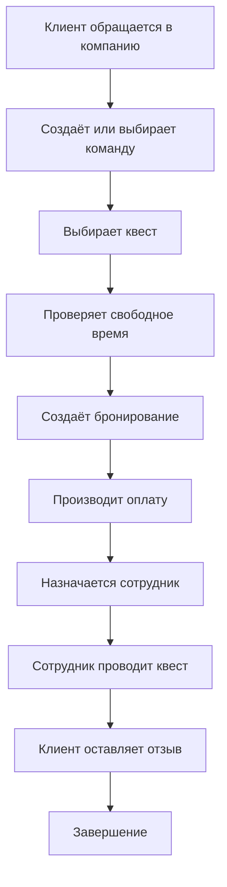

## Информационная система управления квест-комнатами

## Цель проекта

Разработать информационную систему для автоматизации работы квест-компании, которая позволяет управлять клиентами, командами, квестами, бронированиями, сотрудниками и оплатами.

## Задачи проекта

1. Проанализировать работу квест-компании и определить требования к системе.
2. Разработать структуру базы данных для хранения информации о клиентах, командах, квестах, сотрудниках, бронированиях и оплатах.
3. Реализовать управление клиентами, командами, квестами и сотрудниками.
4. Реализовать бронирование квестов и учёт оплаты.
5. Разработать удобный интерфейс, поиск, фильтрацию и формирование отчётов.

## Основные сущности

| *Сущность* | *Назначение* |
|----------|------------|
| **Клиенты** | Хранение данных посетителей |
| **Команды** | Группы участников квеста |
| **Участники команд** | Связь клиентов с командами |
| **Квесты** | Информация о доступных квестах |
| **Квест-комнаты** | Помещения для проведения квестов |
| **Бронирования** | Записи на определённые дату и время |
| **Сотрудники** | Работники квест-компании |
| **Оплаты** | Информация об оплате бронирований |

## Основные возможности

- Добавление, изменение и удаление данных.
- Поиск клиентов и квестов.
- Фильтрация информации.
- Просмотр свободных и занятых временных слотов.
- Создание и отмена бронирований.
- Учёт способов и статусов оплаты.
- Просмотр информации о командах и квестах.
- Формирование статистики и отчётов.

## Логика работы системы


## Предполагаемые технологии

- **Язык программирования:** **_Python_**
- **База данных:** **_SQLite_**
- **Интерфейс:** **_Tkinter_**
- **Система контроля версий:** **_Git_**
- **Хостинг репозитория:** [GitHub](https://github.com/)

## Структура проекта
``` quest-room-system/
|-- README.md
|-- main.py
|-- database.py
|-- requirements.txt
|-- database/
|-- quest_rooms.db
```

## Пример данных

| Клиент | Команда | Квест | Дата | Время | Оплата |
|--------|---------|-------|------|-------|--------|
| ***Иванов Иван*** | Охотники | Заброшенная лаборатория | 15.09.2026 | 19:00 | Оплачено |
| ***Петров Алексей*** | Искатели | Тайна особняка | 16.09.2026 | 18:00 | Ожидается |

## Автор

**Ерыкалов Кирилл** и **~~Шишин Григорий~~**

Учебный проект по специальности **09.02.07 «Информационные системы и программирование»**.

### Статус проекта

`В разработке`
